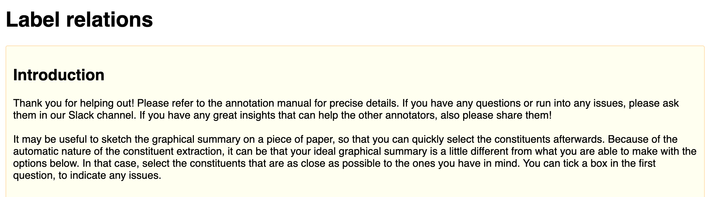
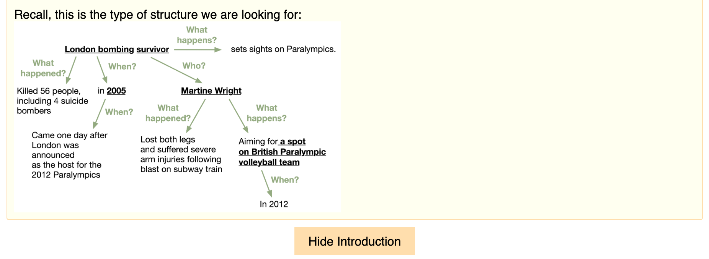
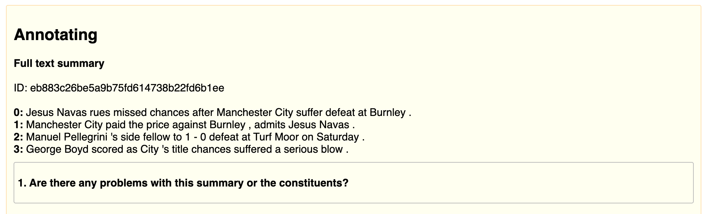
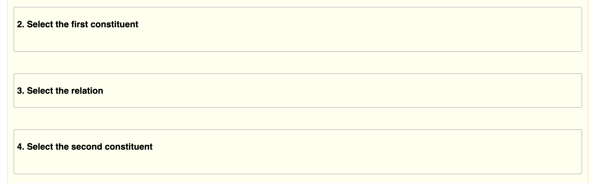
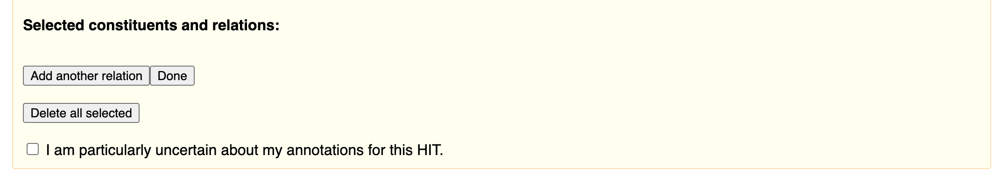
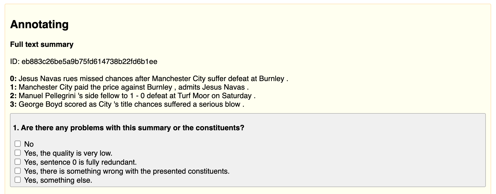
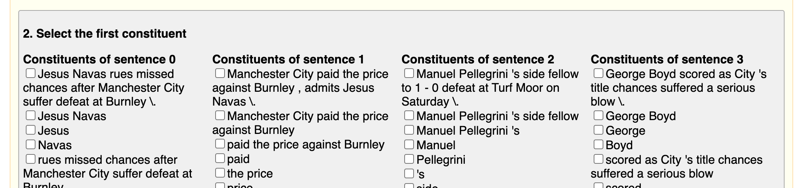
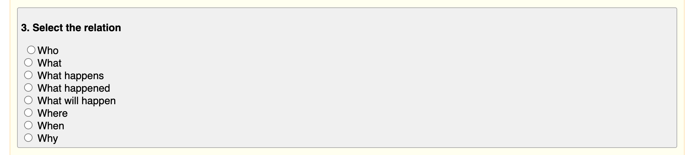

# GraphelSums Dataset

<i> This repository accompanies our paper: </i>

Maartje ter Hoeve, Julia Kiseleva, Maarten de Rijke. [Automatic Summarization with Graphical Elements](https://arxiv.org/pdf/2204.07551.pdf). 

This repository contains the code to obtain ```GraphelSums```, a dataset that supports our work on Summarization with Graphical Elements. If you are interested in the code to run the experiments, have a look at [this repository](https://github.com/maartjeth/summarization_with_graphical_elements).


## Table of contents

1. [Introduction](#introduction)
2. [Human Labeling](#human-labeling)
3. [The Data](#the-data)
4. [BibTex](#bibtex)

## Introduction

```GraphelSums``` is a small-scale human-labeled dataset for automatic summarization. The domain is news, the language is English. We collected this data as part of our efforts to expand the types of automatic summaries that we can create. That is, the vast majority of automatic summarization research is focused on generating summaries in the form of a few lines of text. While successful and useful, this is certainly not the only way to generate summaries. Different users of automatically generated summaries are probably interested in different types of summaries. 

We started to explore this question in our [2022 NAACL paper](https://aclanthology.org/2022.naacl-main.4.pdf), where we developed a survey to study the needs of users of automatically generated summaries. We also found that participants of our survey indicated a whole range of different needs for automatically generated summaries. Pretty exciting, as now we have a full range of new research projects at our disposal! One of these directions is being able to generate summaries with graphical elements, such as arrows, or colored text. These are the types of summaries that we discuss in the paper that is associated with this repository: [Automatic Summarization with Graphical Elements](https://arxiv.org/pdf/2204.07551.pdf)

## Human Labeling

We set up a human-labeling effort to collect ```GraphelSums```. Please refer to the [paper](https://arxiv.org/pdf/2204.07551.pdf) for a detailed explanation. Here we share some screenshots to accompany the explanation in the paper. First we give







Next, some screenshots of the expanded questions:





## The data

We use the CNN/DM dataset (in our paper we explain our rational in detail). You need to [download the data](https://cs.nyu.edu/~kcho/DMQA/) first.

You can find the requirements in the ```./requirements.txt``` and you can install them in a new Python environment by:

```
pip install -r ./requirements.txt
```

### Extracting the titles

If you have a close look at the CNN/DM dataset, you will find that very often you need the titles of the articles to actually being able to understand the summary. In our work we found that this was the case for 80% of the summaries that we studied. Therefore, we opted to include the titles. The code to extract the titles can be found in ```./src/extract_titles.py```. Usage (you need to update the path names with your own):

```
python3 ./src/extract_titles.py --<path_to_data_folder_cnn> --<path_to_output_dict_cnn> --<path_to_data_folder_dm> --<path_to_output_dict_dm>
```

### Processing the data and adding the titles
We use [this](https://github.com/abisee/cnn-dailymail/blob/master/make_datafiles.py) code (from See et al., ACL 2017, [Get To The Point: Summarization with Pointer-Generator Networks](https://aclanthology.org/P17-1099/)) to process the CNN/DM data, i.e., to get the abstracts in a format that we can use. Please refer to their [README](https://github.com/abisee/cnn-dailymail) for how to use this code. 

Just make sure you add the titles that you just extracted. In ```./src/extracting_titles.py```, you made a dictionary with titles for each file. For each file, look up the title, and process it with the ```fix_missing_period()``` function from the code above, i.e., you would want to do something like ```fix_missing_period(title.lstrip())```. You can then add the title to the part where the highlights are constructed, i.e., [here](https://github.com/abisee/cnn-dailymail/blob/master/make_datafiles.py#L128).

### Getting the annotations

We release the start and end indices of the human annotations, and the relations. With this information, you can construct the verbatim summary triples yourself. To make sure you tokenize the abstracts the same way as we did, you can use the ```tokenize_abstract()``` function in ```./src/utils_data_processing.py```. This function takes the processed CNN/DM abstract from the previous step. You may wonder why we did not use a simpler way of tokenization. That's because this code was part of the code in which we constructed the constituents for the human annotators. We wanted to make sure we had the exact same tokenization, to avoid mismatches in the annotations later on.

The file ```human_annotations.json``` should now have all remaining info you need to process the data for your use case. You just need to add your tokenized abstracts in the empty ```tok_abstract``` entry in each dictionary in that file (there is an empty entry, left for you to complete). In ```./src/process_human_annotations.py``` we give an example of how to construct a dictionary that can be used to evaluate the ```DyGIE++``` output (see our [paper](https://arxiv.org/pdf/2204.07551.pdf) and our other [code repo](https://github.com/maartjeth/summarization_with_graphical_elements) for more information on how we use DyGIE++ in our experiments). Usage:

```
python3 ./src/process_human_annotations.py <--your_arguments>
```

Substitute ```<--your_arguments>``` with your own, so that you can refer to the correct file locations, etc. Note: ```--label_file``` should refer to the file where you combined the annotations with your just obtained tokenized abstract.

That should be it! To help you double check whether you followed all the steps exactly as we did, we also included some print statements in the code in ```./src/process_human_annotations.py``` so that you can verify that the annotations you obtained by following these steps make sense.


## BibTex

If you are using this work, please cite:

```
@article{ter2022summarization,
  title={Summarization with Graphical Elements},
  author={ter Hoeve, Maartje and Kiseleva, Julia and de Rijke, Maarten},
  journal={arXiv preprint arXiv:2204.07551},
  year={2022}
}
```

The BibTex for our NAACL paper is:

```
@inproceedings{ter-hoeve-etal-2022-makes,
    title = "What Makes a Good and Useful Summary? {I}ncorporating Users in Automatic Summarization Research",
    author = "Ter Hoeve, Maartje  and
      Kiseleva, Julia  and
      Rijke, Maarten",
    booktitle = "Proceedings of the 2022 Conference of the North American Chapter of the Association for Computational Linguistics: Human Language Technologies",
    month = jul,
    year = "2022",
    address = "Seattle, United States",
    publisher = "Association for Computational Linguistics",
    url = "https://aclanthology.org/2022.naacl-main.4",
    doi = "10.18653/v1/2022.naacl-main.4",
    pages = "46--75",
}
```
